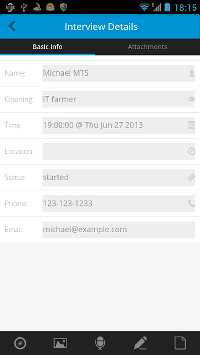

#heroapp: LetsHire MobileApp

###Overview
LetsHire MobileApp is the mobile client of LetsHire, which is a hero application for Tempest project. Currently this mobile app only has an Android edition.

With the help of this mobile app, interviewers can take record of interview feedback through his/her phone in real time, what's more, interviewers is able to take photos at the whiteboard which the candidate writes his/her answer on.

###Demonstration
1. Login view (open app then it will be visible)  
   

2. System settings view  
   

3. User options view  
   

4. Interviews today view  
   

5. Interviews this week view  
   

6. Interviews this month view  
   

7. Interview details view  
   

8. Take interview note  
   

###Architecture Overview
Letshire Mobile App is constructed based on PhoneGap, which allows developers to easily create mobile apps using standardized web APIs for the platforms you care about.

####High-Level architecture

####Mobile Application Framework

###Project File Structure
The codes we wrote are in the assets/www/ dir:

* css/ : css file
* img/	: the logo or icons
* js/	: javascript files
* ~~js/index.js~~ js/letshire.js : our business logic
* ~~js/jquery.mobile.android-theme.js: jquery mobile android theme~~
* themes/android-theme.css
* index.html : app home page, including interviews, interview, settings and other 'pages'
* ~~interview.html : one interview page~~ 
* ~~interviews.html : my interviews~~
* ~~login.html : login page~~
* ~~settings.html : settings page~~
*   
* ~~lets-hire-api-app/ : the fake backend api based on sinatra~~ we will use the real api 

###Run in Emulator
1. Launch Eclipse to open this project.
2. Right click the project and go to **Run As > Android Application**.

###Run in Android Phone
1. Launch Eclipse to open this project.
2. Make sure USB debugging is enabled on your device and plug it into your system. Information can be found on the [Android Developer Site](http://developer.android.com/tools/device.html).
3. Right click the project and go to **Run As > Android Application**.

 
 
 

###PhoneGap
1. Getting Started with Android  
     http://docs.phonegap.com/en/2.5.0/guide_gettingstarted_android_index.md.html#Getting%20Started%20with%20Android
2. Config Emulator
	install image from 'Android SDK manager'
	* Intel x86 Atom System Image
	* Intel x86 Emulator Accelerator
	
3. 	Eclipse plugin
	* WTP for web develper
	* jsdt-jquery : https://svn.codespot.com/a/eclipselabs.org/jsdt-jquery/updatesite
4. 	AIP document:   
	http://docs.phonegap.com/en/2.5.0/index.html
5. 	Wiki  
	https://github.com/phonegap/phonegap/wiki

###Lungo.js
We use [Lungo.js](http://lungo.tapquo.com/) as the main UI library, refer to this [introduction](http://lungo.tapquo.com/howto/prototype/)

###Angular.js
[Angular.js](http://angularjs.org/) is used as our data manipulator.

###How to debug
1. use chrome developer tools to debug the basic feature without phonegap native api.
2. use [Ripple](https://chrome.google.com/webstore/detail/ripple-emulator-beta/geelfhphabnejjhdalkjhgipohgpdnoc?hl=en) emulator
3. use [weinre](http://people.apache.org/~pmuellr/weinre/docs/latest/Home.html) to remote debug it
